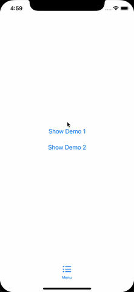
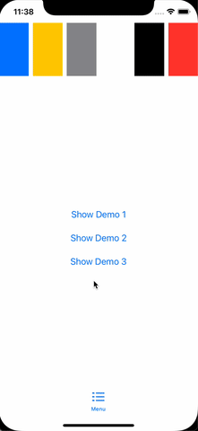

# ZPopupPresenter

Easily to present different popups from any subview over fullscreen on SwiftUI.

<table>
<tr>
<td></td>
<td></td>
<td></td>
</tr>
</table>

## Features
- present different popups of different classes without pre-declaration
- possible to start presenting from any subview or part of code
- present over full screen (or part of screen you really need)
- present several popups
- no need a flag or constants
- supports animations

# Installing
Swift Package Manager:
```
https://github.com/Jnis/ZPopupPresenter.git
```

# Usage

1) Make a shared PresenterModel (ex. by using environment property)
2) Place ZPopupPresenterView on last position of ZStack into your root view

``` swift
import ZPopupPresenter

struct ContentView: View {
    let zPopupPresenterModel = ZPopupPresenterModel() // 1.1. shared model
    
    var body: some View {
        ZStack {
            MyView() 
                .environmentObject(zPopupPresenterModel) // 1.2. inject model for subviews
            
            ZPopupPresenterView(model: zPopupPresenterModel) // 2. popups place
        }
    }
}
```

3) call `showPopup` method of shared model and wrap your view with `AnyView( ... )`
4) call `close` closure to remove popup
``` swift
struct MyView: View {
    @EnvironmentObject var zPopupPresenterModel: ZPopupPresenterModel // shared model
    
    var body: some View {
        VStack {
            Button("Show Popup", action: {
            
                zPopupPresenterModel.showPopup({ close in // 3.
                    AnyView(
                        DemoPopup1View(closeBlock: close) // 4.
                    )
                })
                
            })
        }
    }
}
```

You can find more examples inside `/Examples` folder.

#License 
MIT
